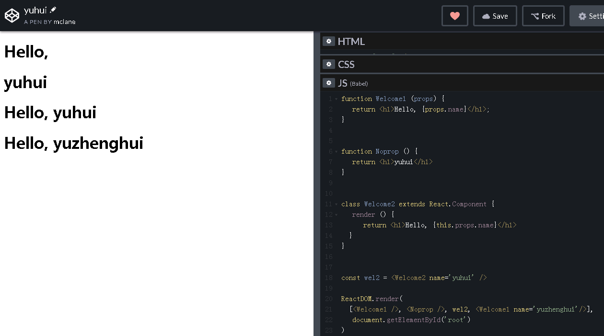

### 1.声明组件时用大写
```javascript
class Welcome2 extends React.Component {
  render () {
    return <h1>Hello, {this.props.name}</h1>
  }
}

const wel2 = <Welcome2 name='yuhui' />
```
> Welcome2 而不是 welcome2

### 2.同时引用组件用数组包含
```javascript
ReactDOM.render(
  [wel1, wel2], // 这里用数组
  document.getElementById('root')
);
```

### 3.渲染时组件标签的写法
```javascript
function Welcome1 (props) {
  return <h1>Hello, {props.name}</h1>;
}

function Noprop () {
  return <h1>yuhui</h1>
}

class Welcome2 extends React.Component {
  render () {
    return <h1>Hello, {this.props.name}</h1>
  }
}

const wel2 = <Welcome2 name='yuhui' />
      
ReactDOM.render(
  [<Welcome1 />, <Noprop />, wel2, <Welcome1 name='yuzhenghui'/>],
  document.getElementById('root')
)
```


### 4.组件嵌套
这个有点绕
```javascript
function Comment(props) {
  return (
    <div className="UserInfo">
      
      <div className="UserInfo-name">
        {props.author.name}
      </div>
    </div>
    ...
  )
}

function Avator(props) {
  return <p>{props.user.name}{props.user.avatarUrl}</p>
}

function UserInfo(props) {
  return (
    <div>
      <Avator user={props.user} />
      <div>
        {props.user.name}
      </div>
    </div>
  )
}

// 修改后的Comment组件
function Comment(props) {
  return (
    <UserInfo user={props.author} />
  )
}

var obj = {name: 'yyy', avatarUrl: 'zzz'}
ReactDOM.render(
  <Comment author={obj} />, // 用{}括起变量赋值给author属性
  document.getElementById('root')
)
```
> 这里写的这个例子有点绕，可以把UserInfo里的user属性换成和Avator里的user属性不一样，便于区分


